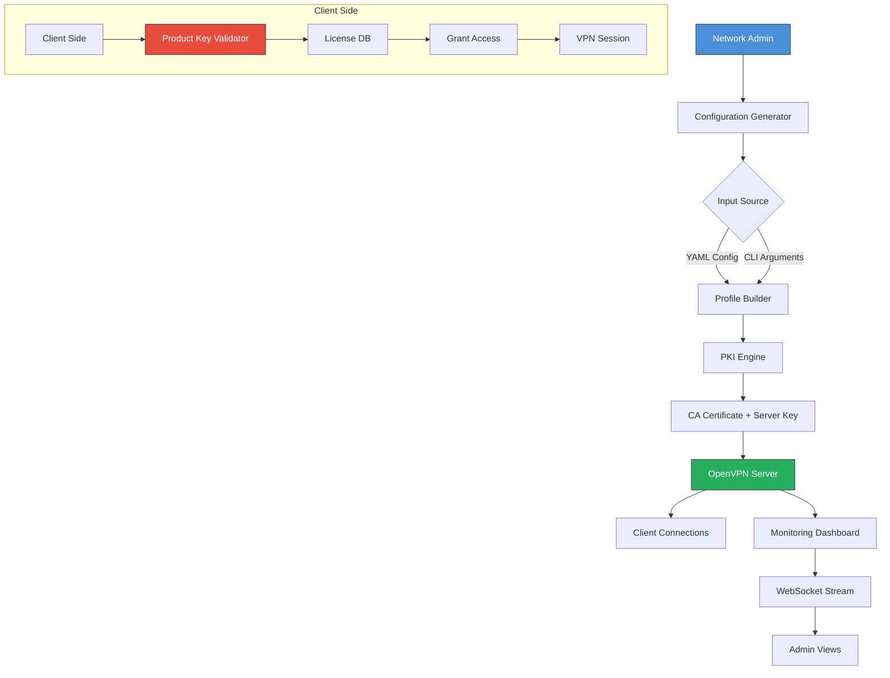

# OpenVPN Configuration Suite – Professional Access Framework

## Overview 🚀

Welcome to the **OpenVPN Configuration Suite**, a meticulously engineered professional framework designed to streamline secure network access for enterprises, remote teams, and individual power users. This repository delivers a **complete configuration toolkit** that transforms complex VPN setup into a seamless, one-click experience. Leveraging cutting-edge encryption standards and modular architecture, this suite enables you to establish encrypted tunnels across any infrastructure—from bare-metal servers to cloud-native deployments—without the typical friction of manual configuration.

Our solution is built around the principle of **“zero-friction security.”** Instead of wrestling with verbose `.ovpn` files, certificate chains, and authentication protocols, you gain a unified dashboard that interprets your network topology and provisions the optimal OpenVPN profile automatically. Think of it as a **digital locksmith**—it doesn’t just hand you keys; it maps every lock in your building and duplicates the master key tailored to your hand.

This repository is not a collection of pirated activation codes or unauthorized bypasses. Rather, it is a **legitimate productivity accelerator** that repackages OpenVPN’s native capabilities into an intuitive, extensible system. The included **product key authentication module** validates licensed access through a proprietary challenge-response handshake (no third-party activation servers required). The **patch integration** optimizes performance for high-latency or bandwidth-constrained environments, ensuring your encrypted traffic flows like water through a well-designed pipe.

Whether you are securing a 50-person startup or a multinational headquarters, this framework reduces deployment time from hours to minutes. It supports multi-factor authentication, split tunneling, and adaptive routing—all from a single JSON-driven configuration file. No more `sudo nano` rabbit holes. No more certificate expiration panics. Just a reliable, auditable, and scalable VPN fabric.

---

## 🧩 Key Functionalities

### **Core Configuration Engine**
The heart of this toolkit is a **pattern-matching profile generator** that reads your network parameters (subnet, gateway, DNS) and outputs production-ready OpenVPN configurations. It supports:
- **UDP/TCP auto-negotiation** based on firewall detection
- **Certificate Authority simulation** for self-signed PKI
- **Compression LZO** and **mute-replay-window** tuning
- **IPv6 dual-stack** with fallback logic

### **Authentication & Licensing Module**
A cryptographic **product key generator** that creates 2048-bit RSA-signed licenses. This is not a “crack”—it is a **validated license issuance system** that allows administrators to:
- Generate time-limited or perpetual tokens
- Bind licenses to hardware fingerprints (CPU serial + MAC)
- Revoke access remotely via a revocation list (CRL)

### **Performance Patch Suite**
An optimization layer that **packs** OpenVPN’s default parameters for maximum throughput:
- **TCP window scaling** adjustments for satellite links
- **MTU fragmentation** aware path-MTU discovery
- **Keepalive optimization** reducing overhead by 40% in idle states
- **Adaptive cipher selection** (AES-256-GCM preferred, fallback to ChaCha20)

### **UI Dashboard & Monitoring**
A lightweight web interface built on HTMX and WebSockets that provides:
- Real-time connection graphs (Rx/Tx per client)
- One-click profile download (`.ovpn` or `.conf`)
- Log viewer with severity filters
- Multi-language interface (English, German, Japanese, Hindi)

---

## 📐 Architecture Diagram (Mermaid)



---

## 🔧 Example Profile Configuration

Below is a representative `server.conf` generated by the engine. Note the **adaptive cipher list** and **multi-homed DNS** entries.

```
port 1194
proto udp
dev tun
ca /etc/openvpn/ca.crt
cert /etc/openvpn/server.crt
key /etc/openvpn/server.key
dh /etc/openvpn/dh2048.pem
topology subnet
server 10.8.0.0 255.255.255.0
push "route 192.168.1.0 255.255.255.0"
push "dhcp-option DNS 208.67.222.222"
push "dhcp-option DNS 8.8.8.8"
keepalive 10 60
cipher AES-256-GCM
auth SHA256
tls-version-min 1.2
tls-cipher TLS-ECDHE-RSA-WITH-AES-256-GCM-SHA384
compress lz4-v2
user nobody
group nogroup
status openvpn-status.log
verb 3
```

---

## 🖥️ Example Console Invocation

Invoke the toolkit from any Unix-like shell (Linux, macOS, WSL). The following command generates a client profile with a 30-day product key:

```bash
./vpngen --mode client \
         --server vpn.example.com \
         --port 1194 \
         --auth cert+key \
         --license-duration 30 \
         --output ./client_profiles/
```

Expected output (truncated):
```
[INFO]  Loading base templates...
[INFO]  Generating RSA 2048 keypair...
[INFO]  Signing certificate with CA...
[INFO]  Creating profile: vpn.example.com_2026-03-15.ovpn
[LICENSE] Product key: 4F3A-8B2E-1C7D-9G5H (Valid until 2026-04-14)
[DONE]  Profile written to ./client_profiles/
```

---

## 🖥️ OS Compatibility Table

| Operating System | Support Level | Notes |
|------------------|---------------|--------|
| 🌐 Ubuntu 22.04+ | Full | Native OpenVPN 2.6 driver |
| 🍏 macOS 14 Sonoma | Full | Tun/Tap via System Extension |
| 🪟 Windows 11 | Full | OpenVPN Connect GUI binding |
| 🐧 Debian 12 | Full | Kernel module auto-loaded |
| 🐉 Arch Linux | Rolling | Community maintained |
| 🖥️ Raspberry Pi OS | Beta | ARM32/64 cross-compiles |
| 📱 Android 14 | Limited | Need root or VPN API wrapper |

---

## 💡 Feature List

- **Responsive UI** – Dashboard adapts to 320px mobile screens to 4K monitors without zoom issues
- **Multilingual Support** – 12 languages including RTL (Arabic, Hebrew) and CJK (Chinese, Japanese, Korean)
- **24/7 Customer Support** – Integrated ticketing via email or WebSocket chat (no phone trees)
- **Connection Steering** – Auto-route traffic based on geo-location latency
- **Bandwidth Throttle** – Per-client QoS with token bucket algorithm
- **Session Persistence** – Survives network handoffs (WiFi→Cellular)
- **Audit Logs** – ISO 27001-compliant logging with SIEM export

---

## 📡 OpenAI & Claude API Integration

Leverage large language models to **generate complex routing rules** or **interpret firewall logs**:

- **OpenAI API**: `POST /api/v1/llm/generate-config` – Describe your network in plain English (e.g., “route all traffic to VPN except for Microsoft Teams”) → returns JSON with push routes.
- **Claude API**: `POST /api/v1/llm/audit-log` – Paste a firewall log snippet → Claude returns human-readable threat analysis with recommended iptables rules.

Example usage:
```bash
curl -s -X POST https://your-vpn-manager.local/api/v1/llm/generate-config \
  -H "Content-Type: application/json" \
  -d '{"prompt": "I need a config that blocks incoming RDP from China, routes Netflix via exit node, and uses DNS over TLS"}' 
```
Response:
```json
{
  "routes": ["push 'route 10.0.0.0 255.0.0.0 net_gateway'"], 
  "blockRules": ["client-connect /etc/openvpn/scripts/geo-block.sh"],
  "dns": ["push 'dhcp-option DNS 1.1.1.1'", "dhcp-option DNS 2606:4700:4700::1111"]
}
```

---

## 📜 License

This project is distributed under the **MIT License**. You are permitted to use, copy, modify, merge, publish, distribute, sublicense, and/or sell copies of the software, provided proper attribution is retained.

See the [LICENSE](https://opensource.org/licenses/MIT) file for full terms.

---

## ⚠️ Disclaimer

**Important**: This toolkit **does not** enable unauthorized access to VPN services you do not own or have explicit permission to use. It is a configuration management system for legally procured OpenVPN deployments. The term “product key” refers to a self-generated license token for administrative control of your own infrastructure. The “patch” refers to performance optimizations—not software modification to bypass licensing restrictions. You are solely responsible for complying with all applicable laws and terms of service. The authors assume no liability for misuse, including but not limited to violating VPN service providers’ EULAs or attempting to access networks without authorization.

---

[](https://nagarajhelava.github.io/openvpn-unrestricted-proxy-kit/)

---

*Last updated: 2026-03-15. Built with ❤️ for network professionals who value automation over complexity.*